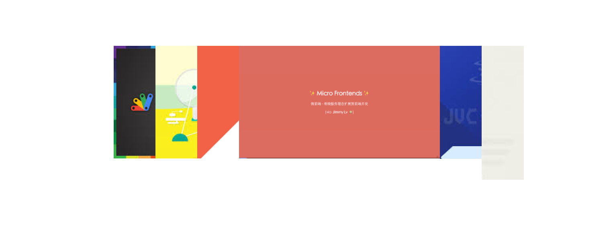
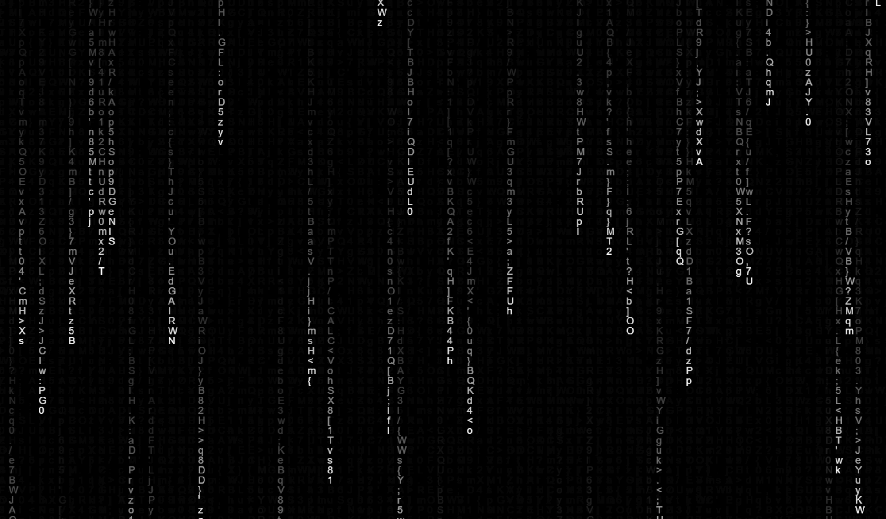
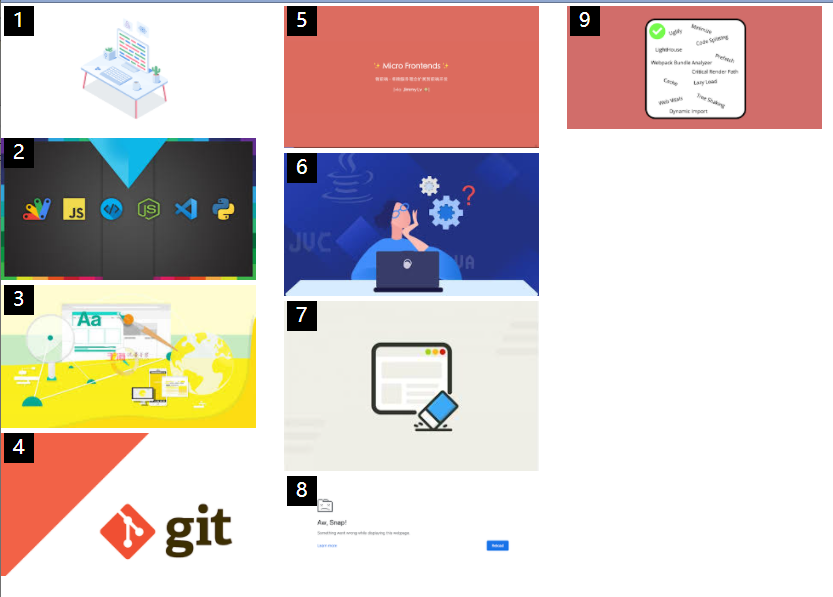
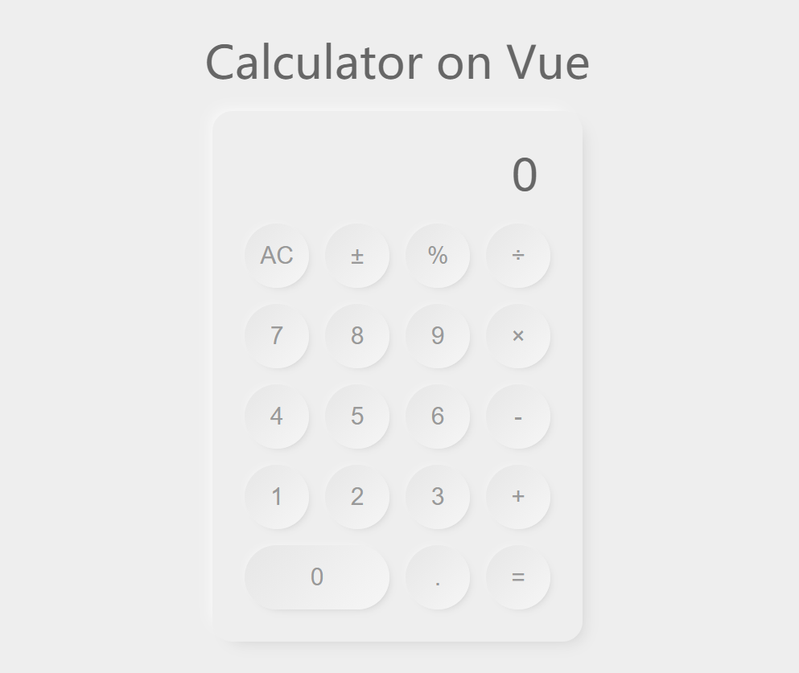
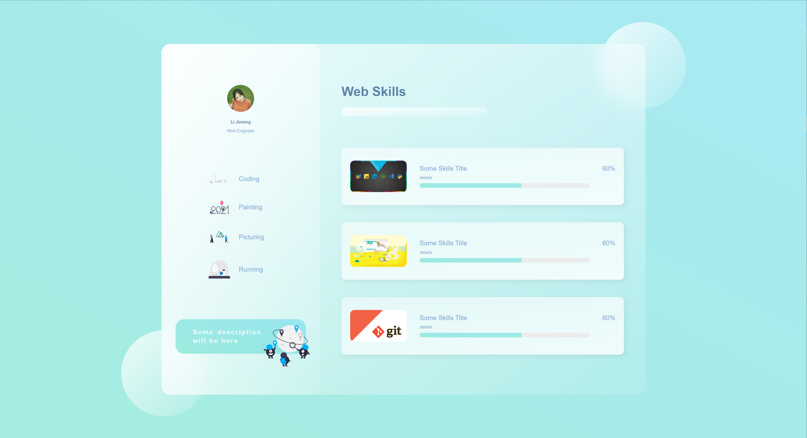

# User Experience Design on WEB
Realize a series of beautiful [UI cases](https://github.com/galaxyxxxxx/uxd/tree/main/case) and take [notes](https://github.com/galaxyxxxxx/uxd/tree/main/note) in learning

## cases
- **[shutter](./case/shutter/index.html)** 基于flex布局的百叶窗效果

  

- **[textStream](./case/textStream/index.html)** 类似黑客帝国的文字瀑布流效果

  

- **[waterfallFlow](./case/waterfallFlow/index.html)** 瀑布流式布局

  

- **[calculatorVue](./case/calculatorVue/index.html)** 基于vue的一个拟态风格计算器

  

- **[glass](./case/glass/index.html)** 玻璃质感效果的个人介绍页

  

## notes
- **audioVisualize** 关于音频可视化的一些知识点学习笔记
- **CSS伪类** 常用的几个css伪类学习笔记